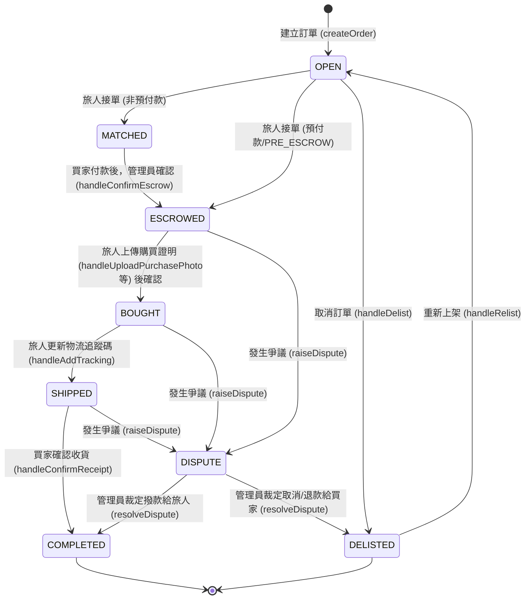

# 訂單流程分析與邏輯漏洞報告

針對目前的訂單流程 (`app/orders/[id]/page.tsx` 及 `utils/api.ts`) 的檢視結果如下。

## 1. 訂單狀態流程圖

以下是目前系統中訂單的狀態流轉機制，包含「一般購買」與「爭議處理」流程：

## 2. 發現的邏輯漏洞 (Logic Loopholes)

目前的實作在狀態機推進、資料庫約束與前端權限管控上存在多個漏洞，可能導致越權操作與資料不一致：

### A. 嚴重安全性風險 (API Level) [✅ 已透過 Server Actions 與 RLS 完全修復]

1. **狀態機缺乏後端保護 (State Machine Bypass)**
   - **原本問題**: 前端可以隨意發送 API 呼叫將訂單強制推進至 `COMPLETED`。
   - **✅ 修復結果**: 已經將狀態變更 (完成訂單、接單、上傳收據等) 全部搬移到 `app/actions/orders.ts` 中透過 Server Actions 搭配 Service Role Key 執行，並在 Server 端加上 `if (order.status !== '...') throw Error` 的強制防護。現在前端已經無法直接繞過。

2. **自行篡改統計數據 (Stats Manipulation)**
   - **原本問題**: 前端可以直接呼叫 `incrementOrderStats` 來隨意灌水業績金額。
   - **✅ 修復結果**: 統計邏輯已移至 Server Actions (`confirmReceipt`, `adminReleaseFunds` 等) 內處理，在完成訂單撥款的第一時間由後端直接使用 Service Role 從資料庫讀取真實金額累加。此 RPC 不再開放給前端呼叫，並且已鎖定 RLS。

3. **越權更新訂單內容 (Unauthorized Update)**
   - **原本問題**: 惡意攻擊者可以任意修改他人的訂單明細內容與收貨狀況。
   - **✅ 修復結果**: 已在 Server Actions 內加上嚴格的全域身份比對 (e.g. `order.buyer_id !== user.id`)。此外，資料庫 RLS 已將 `UPDATE` 的 Policy 全數刪除，確保沒人能夠不透過 Server Actions (Service Role) 的防線直接竄改資料。

4. **無限制下架/取消機制 (Delist/Cancel Anytime)**
   - **原本問題**: 買家可以在訂單已經付款或是出貨時，透過前端發出下架 API 呼叫強行取消。
   - **✅ 修復結果**: `delistOrderGroup` 已轉移為 Server Action，加入了嚴格的 `order.status !== 'OPEN'` 阻擋規則；如果是管理員裁決 `DELISTED` 則受管理員身份控制。

### B. UI / 前端實作疏漏

5. **出貨與物流單號填寫區塊權限外洩 [✅ 已修復]**
   - **所在位置**: `app/orders/[id]/page.tsx` 約 957-975 行
   - **原本問題**: 處理 `BOUGHT` 狀態的 UI 區塊時，追蹤碼的 `<Input>` 與發貨按鈕沒有被 `{role === 'traveler'}` 保護。
   - **✅ 修復結果**: 已經加上 `{role === 'traveler' ? (...) : 
請等待旅人更新出貨資訊
}` 條件渲染判斷，防止非旅人操作。

6. **確認收貨缺乏防呆防連點 (Double Click Problem) [✅ 已修復]**
   - **所在位置**: `app/orders/[id]/page.tsx` 中的 `handleConfirmReceipt` 函式
   - **原本問題**: 狂按「確認收貨」按鈕可能多次送出 API 請求，導致旅人的業績統計數據被重複計算。
   - **✅ 修復結果**: 改呼叫 `confirmReceipt` Server Action 後，由於此動作有 `status === 'SHIPPED'` 的前置條件，當第一筆請求改為 `COMPLETED` 後，其他連點的請求會因為不符合 `SHIPPED` 條件而在 Server 端拋出阻擋。

7. **爭議解決機制的去向僵化 (State Rewind Missing) [⚠️ 待修復]**
   - **問題**: 當管理員點擊 `handleResolveDispute`，只能被迫選擇「完成訂單撥款 (`COMPLETED`)」或「取消訂單退款 (`DELISTED`)」。如果在剛進入 `ESCROWED` 或 `BOUGHT` 時雙方發生誤會或需補件而進入爭議，管理員無法將訂單狀態「退回」先前的作業階段（例如退回 `ESCROWED` 讓旅人補上傳清晰收據）。
   - **對策**: 在資料庫增加 `previous_status` 紀錄進入 `DISPUTE` 前的狀態，或在管理頁面開放手動將訂單切換回原始狀態的功能。
